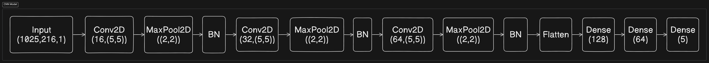
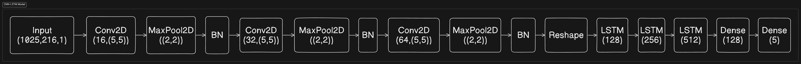
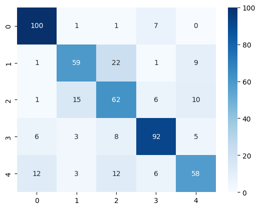

# Music Mood Classification

## Technologies Used

- Numpy (for faster calculations)
- Tensorflow (for model creation)
- Librosa (for reading wave files)
- Matplotlib (for visualization)
- Sklearn (for computing metrics)
- Kaggle Platform

Dataset: <https://www.kaggle.com/datasets/auliayasmin/music-mood-classification>

- Classes: ['aggressive', 'sad', 'romantic', 'happy', 'dramatic']
- SAMPLING_RATE = 22050
- WAVE_SHAPE = (110250,)
- STFT_SHAPE = (1025,216,1)
- MFCC_SHAPE = (128,216,1)

## Properties Extracted from wave file

- STFT (Short Term Fourier Transformer)
- MFCC (Mel Frequency Cepstral Coefficients)

## CNN Model

<h4>Test Accuracy : 86%</h4>
<h4>Train Accuracy : 97%</h4>

## CNN-RNN Model

<h4>Test Accuracy : 73%</h4>
<h4>Train Accuracy : 94%</h4>

## Two Stream Model

<h4>Test Accuracy : 74%</h4>
<h4>Train Accuracy : 90%</h4>
